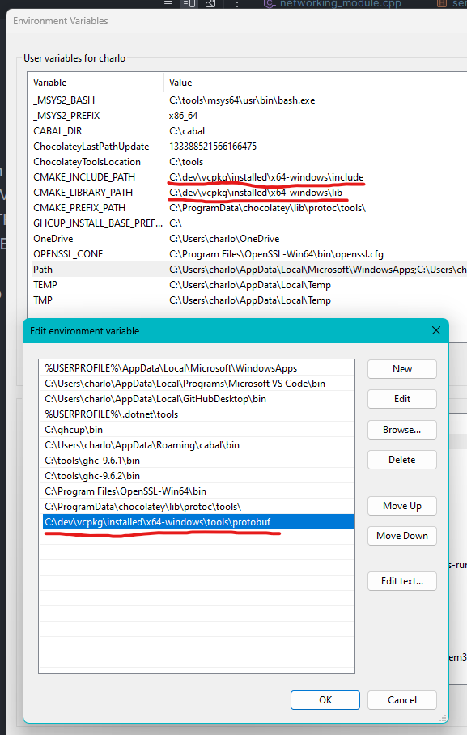

# Prerequisites

- GameNetworkingSockets
  - Install OpenSSL through Chocolatey
  - Install Protobuf through VCPKG; Set CMAKE_INCLUDE_PATH to the include folder of VCPKG and CMAKE_LIBRARY_PATH to the lib folder of VCPKG
  - 