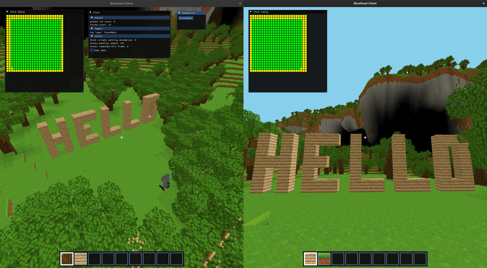
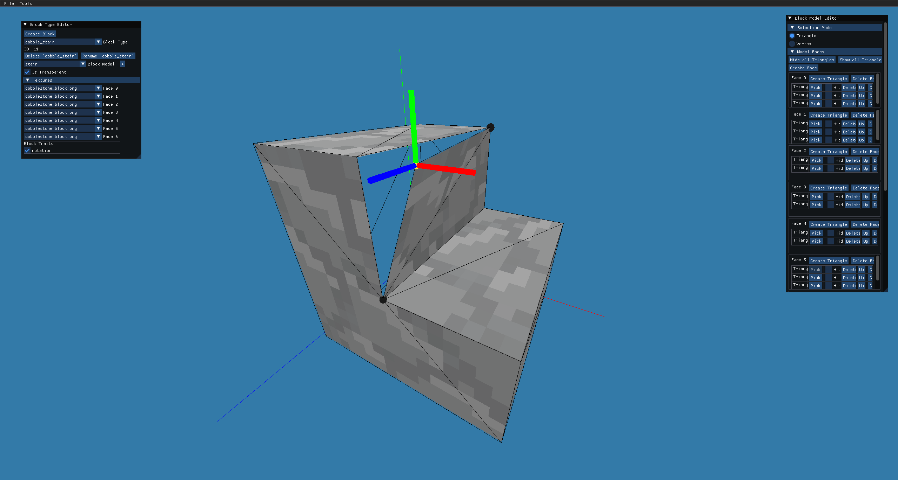
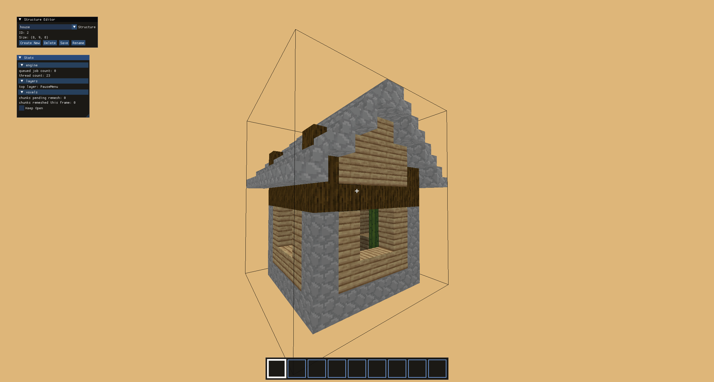
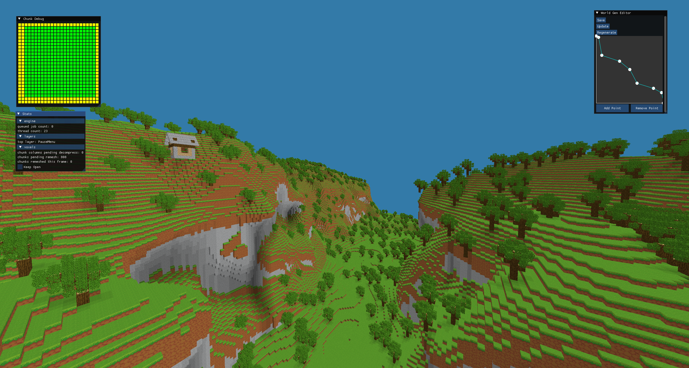

# BlueVoxel

A voxel game and engine (strongly) inspired by Minecraft

## Multiplayer

The game uses a server-client architecture

## Editors

### Block Editor

Create new block and block models

### Structure Editor

Create and manage structures that can spawn randomly in the world

### Terrain editor

Edit terrain generation values through a graph of block probability per height

